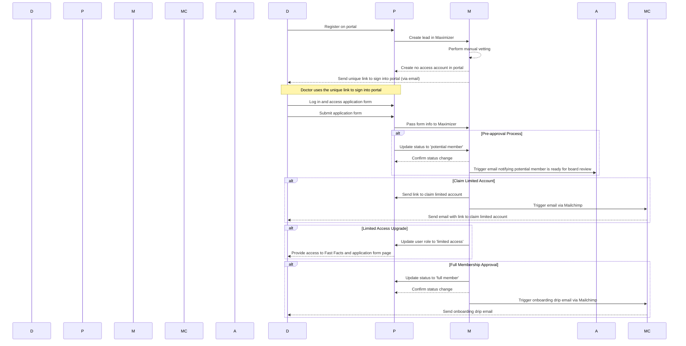

### Technical Design Document

## Title: Doctor Registration and Approval Process

### 1. Front-end: Vue.js
- **Upgrade from Vue 2 to Vue 3** to ensure the latest features and security updates.
- **Secure login** and secure data transfer between Vue.js and WordPress.

### 2. Back-end: WordPress
- **Upgrade WordPress from PHP 7.4 to PHP 8.4** to address critical security vulnerabilities.
- **Evaluate CVEs (Common Vulnerabilities and Exposures)**:
  - Perform a CVE scan for all plugins and dependencies used in the WordPress environment.
  - Update or replace any plugins with known vulnerabilities.
  - Implement regular CVE monitoring and patch management.

### 3. Database: MySQL
- Configure **Amazon RDS for MySQL** to ensure reliable and scalable database management.
- Set up **DB backup on AWS** to ensure data is regularly backed up and can be restored in case of any failure.

### 4. Infrastructure: AWS
- Use AWS for hosting, including setting up **EC2 instances**.
- Use **Amazon S3** for image storage.
- Set up **CI/CD pipelines using AWS CodePipeline** from GitHub.
- Configure multiple environments: development, testing, staging, and production.
- Implement infrastructure monitoring using **AWS CloudWatch**.
- Ensure secure data transfer and encryption.

### 5. Integration
- **Maximizer CRM Integration**: Integrate WordPress with Maximizer CRM to handle lead creation and status updates.
- **Mailchimp Integration**: Integrate Maximizer CRM with Mailchimp API for sending emails to doctors at various stages of the registration process.
- Changes in Maximizer CRM should reflect in the WordPress portal.

### 6. QA Strategies
- Develop automated and manual testing strategies for all environments.
- Perform security testing to ensure all data transfers are secure.
- Implement logging and monitoring for all critical actions and data changes.

### 7. User Roles and Capabilities
- **Custom User Roles**:
  - **limited_access**: Pre-approved doctors with limited access to specific portal features.
  - **full_member**: Fully approved doctors with full access to all portal features.

### 8. Integration with External Services
- Develop **custom plugins** for integration with:
  - **Maximizer CRM**
  - **Mailchimp API** (via Maximizer CRM)

### 9. Security Measures
- Implement WordPress security best practices:
  - Use **SSL/TLS** for all communications.
  - Implement strong **password policies**.
  - Utilize security plugins (e.g., Wordfence, Sucuri) for additional protection.

### 10. CI/CD Pipeline
- **GitHub Integration**:
  - Set up a GitHub repository for version control.
  - Configure **branch protection rules** for the main branch to ensure code quality and security.

### 11. Handling Expired Login Emails
- Generate time-limited tokens for login links.
- Store token expiration time in the database.
- Validate token expiry when doctor clicks the link.
- Prompt doctor to request a new login email if token has expired.

### 12. Entity Definition for Doctor Registration
#### Forms and Fields (Compliant with Alberta Requirements):
1. **Personal Information**
   - First Name
   - Last Name
   - Email Address
   - Password
   - Confirm Password
   - Phone Number

2. **Professional Information**
   - Medical License Number
   - Specialization
   - Clinic Address
   - City (Automatically set to Alberta)
   - Postal Code
   - Country (Automatically set to Canada)

3. **Additional Information**
   - Education Details
   - Work Experience
   - References
   - Certifications (Optional)
   - Upload Documents (Optional)

#### Form Validation:
- **Email Address**: Must be a valid email format.
- **Password**: Must meet Alberta's security standards for passwords.
- **Phone Number**: Must be a valid Canadian phone number format.
- **Medical License Number**: Validated against Alberta's specific medical licensing format.
- **Postal Code**: Must be a valid Canadian postal code format.
- **File Uploads**: Allowed formats should include PDF, DOCX, etc., with size restrictions.

#### UI Components (Built on Vue.js):
- **Form Components**: Custom components for input fields, file uploads, and validation messages.
- **Navigation**: Navigation bar, footer, and side panels.
- **Alerts**: Custom alert and notification components for form submission success/failure.
- **Modals**: Modal dialogs for confirmation messages and additional info.
- **Buttons**: Standardized button components with consistent styling.

### Eraser Code for Architecture Diagram

```eraser
title Doctor Registration and Approval Process

Vue.js Front-end [icon: monitor, color: green] ->|API Requests| WordPress Back-end [icon: database, color: blue]
WordPress Back-end [icon: database, color: blue] ->|Database Queries| MySQL Database [icon: database, color: orange]
WordPress Back-end [icon: database, color: blue] ->|Image Storage| Amazon S3 [icon: cloud, color: red]
GitHub Repository [icon: code, color: black] ->|Code Push| AWS CodePipeline [icon: pipeline, color: yellow]
AWS CodePipeline [icon: pipeline, color: yellow] ->|Deploy| Vue.js Front-end [icon: monitor, color: green]
AWS CodePipeline [icon: pipeline, color: yellow] ->|Deploy| WordPress Back-end [icon: database, color: blue]
AWS CloudWatch [icon: eye, color: purple] ->|Monitor| Vue.js Front-end [icon: monitor, color: green]
AWS CloudWatch [icon: eye, color: purple] ->|Monitor| WordPress Back-end [icon: database, color: blue]
AWS CloudWatch [icon: eye, color: purple] ->|Monitor| MySQL Database [icon: database, color: orange]
AWS CloudWatch [icon: eye, color: purple] ->|Monitor| Amazon S3 [icon: cloud, color: red]
Maximizer CRM [icon: crm, color: cyan] <->|API Integration| WordPress Back-end [icon: database, color: blue]
Mailchimp API [icon: mail, color: brown] <->|API Integration| WordPress Back-end [icon: database, color: blue]
```

### Time Sequence Diagram for Doctor Registration and Approval Process



This Technical Design Document includes both the architecture diagram and the time sequence diagram for the Doctor Registration and Approval Process, providing a comprehensive view of the system's structure and workflow.
